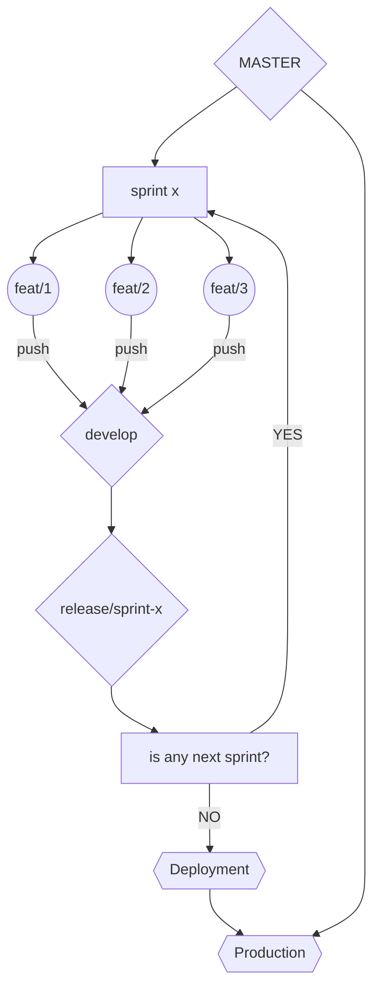

## Git Command Note

**Git Setup**

<ul>
<li>git config --global user.name “[firstname lastname]” : mengatur nama agar terlihat pada kredit saat review history</li>
<li>git config --global user.email “[valid-email]” : mengatur email</li>
<li>git config --global color.ui auto : mengatur warna command line agar mudah untuk dilihat</li>
</ul>

**Git Setup & init**
git init : menginisialisasi project git
git clone [url] : cloning suatu repository

**Git Stage & Snapshot** -git status : memperlihatkan perubahan pada file kerja untuk commit selanjutnya -git add [file] : menambahkan file ke dalam staging -git reset [file] : unstage file yang sudah masuk kedalam stage -git diff : membantu untuk melihat, membandingkan, dan memahami perubahan di dalam project dan belum masuk staging -git diff --stage : membantu untuk melihat, membandingkan, dan memahami perubahan di dalam project dan sudah masuk staging -git commit -m “[descriptive message]” : melakukan commit pada perubahan project yang dilakukan

**BRANCH & MERGE** -git branch : melihat list branch -git branch [branch-name] : membuat branch baru -git checkout [branch-name] : pindah branch -git merge [branch] : merge branch yang diinginkan menjadi 1 dengan branch yang dituju -git log : melihat semua commit pada history branch saat ini

**INSPECT & COMPARE** -git log branchB..branchA : memperlihatkan commit-an yang ada di branch A yang tidak ada di branch B -git log --follow [file] : melihat semua perubahan commit pada file tertentu bahkan sampai pada perubahan nama file -git diff branchB...branchA : memperlihatkan perbedaan yang ada di dalam branch A yang tidak ada di branch B -git show [SHA] : menampilkan objek apa pun di Git dalam format yang dapat dibaca manusia

**TRACKING PATH CHANGES** -git rm [file] : menghapus file dari project dan meremove commit-an -git mv [existing-path] [new-path] : mengubah jalur file yang ada dan melakukan perpindahan -git log --stat -M : tampilkan semua log commit dengan indikasi jalur apa pun yang dipindahkan

**SHARE & UPDATE** -git remote add [alias] [url] : menambahkan git URL dengan alias -git fetch [alias] : mengambil perubahan dari seluruh branch -git merge [alias]/[branch] : melakukan merge dari brach tertentu -git push [alias] [branch] : melakuan transmit dari project di lokal menujut GIT -git pull : melakukan fetch dan merge dari berbagai commit dari branch tertentu

**REWRITE HISTORY**
git rebase [branch] : melakukan commit apapun dari branch saat ini sehingga bisa sejajar dengan branch terdepan
git reset --hard [commit] : menghapus seluruh staging, mengulang kembali working tree dari commit yang ditentukan

**TEMPORARY COMMITS**
git stash : menyimpan perubahan dan dilakukan staging dari perubahan tersebut
git stash list : list urutan perubahan file yang dilakukan
git stash pop : menghapus atau membuang stash terbaru atau yang paling atas -`git stash drop` : menghapus stash terbaru

Commit flow chart :

