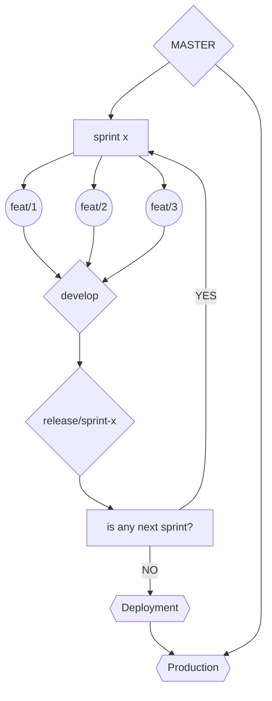

## Git Command Note

**GIT SETUP**

<ul>
<li>git config --global user.name “[firstname lastname]” : mengatur nama agar terlihat pada kredit saat review history</li>
<li>git config --global user.email “[valid-email]” : mengatur email</li>
<li>git config --global color.ui auto : mengatur warna command line agar mudah untuk dilihat</li>
</ul>

**GIT SETUP & INIT**

<ul>
<li>git init : menginisialisasi project git</li>
<li>git clone [url] : cloning suatu repository</li>
</ul>

**GIT STAGE & SNAPSHOOT**

<ul>
<li>git status : memperlihatkan perubahan pada file kerja untuk commit selanjutnya</li> 
<li>git add [file] : menambahkan file ke dalam staging</li> 
<li>git reset [file] : unstage file yang sudah masuk kedalam stage</li> 
<li>git diff : membantu untuk melihat, membandingkan, dan memahami perubahan di dalam project dan belum masuk staging </li>
<li>git diff --stage : membantu untuk melihat, membandingkan, dan memahami perubahan di dalam project dan sudah masuk staging </li>
<li>git commit -m “[descriptive message]” : melakukan commit pada perubahan project yang dilakukan</li>
</ul>

**BRANCH & MERGE**

<ul>
<li>git branch : melihat list branch <li>git branch [branch-name] : membuat branch baru </li>
<li>git checkout [branch-name] : pindah branch <li>git merge [branch] : merge branch yang diinginkan menjadi 1 dengan branch yang dituju </li>
<li>git log : melihat semua commit pada history branch saat ini</li>
</ul>

**INSPECT & COMPARE**

<ul>
<li>git log branchB..branchA : memperlihatkan commit-an yang ada di branch A yang tidak ada di branch B </li>
<li>git log --follow [file] : melihat semua perubahan commit pada file tertentu bahkan sampai pada perubahan nama file </li>
<li>git diff branchB...branchA : memperlihatkan perbedaan yang ada di dalam branch A yang tidak ada di branch B </li>
<li>git show [SHA] : menampilkan objek apa pun di Git dalam format yang dapat dibaca manusia</li>
</ul>

**TRACKING PATH CHANGES**

<ul>
<li>git rm [file] : menghapus file dari project dan meremove commit-an</li>
 <li>git mv [existing-path] [new-path] : mengubah jalur file yang ada dan melakukan perpindahan </li>
<li>git log --stat -M : tampilkan semua log commit dengan indikasi jalur apa pun yang dipindahkan</li>
</ul>

**SHARE & UPDATE**

<ul>
<li>git remote add [alias] [url] : menambahkan git URL dengan alias</li>
<li>git fetch [alias] : mengambil perubahan dari seluruh branch</li>
<li>git merge [alias]/[branch] : melakukan merge dari brach tertentu</li> 
<li>git push [alias] [branch] : melakuan transmit dari project di lokal menujut GIT</li> 
<li>git pull : melakukan fetch dan merge dari berbagai commit dari branch tertentu</li>
</ul>

**REWRITE HISTORY**

<ul>
<li>git rebase [branch] : melakukan commit apapun dari branch saat ini sehingga bisa sejajar dengan branch terdepan</li>
<li>git reset --hard [commit] : menghapus seluruh staging, mengulang kembali working tree dari commit yang ditentukan</li>
</ul>

**TEMPORARY COMMITS**

<ul>
<li>git stash : menyimpan perubahan dan dilakukan staging dari perubahan tersebut</li>
<li>git stash list : list urutan perubahan file yang dilakukan</li>
<li>git stash pop : menghapus atau membuang stash terbaru atau yang paling atas</li> 
<li>git stash drop : menghapus stash terbaru</li>
</ul>

**TAGGING COMMENT**

<ul>
<li>git tag : list semua tag</li>
<li>git tag [name] [commit sha] : membuat refrensi nama utk commit saat ini. menambahkan commit sha utk menandai komit tertentu, bukan commit saat ini</li>
<li>git tag -a [name] [commit sha] : Buat objek tag bernama name untuk commit saat ini.</li> 
<li>git tag -d [name] : menghapus tag dr repository local</li>
</ul>

**SYNCRONIZING REPOSITORY**

<ul>
<li>git fetch [remote] : mengambil perubahan pada branc / remote terbaru tetepi tidak merubah branch</li>
<li>git fetch --prune [remote] : menghapus refrensi remote yang telah dihapus dari repository</li>
<li>git pull [remote] : mengambil perubahan</li> 
<li>git push [--tags] [remote] : mengirim perubahan ke remote</li>
<li>git push -u [remote] [branch] : mengirim perubahan branch lokal ke remote repository</li>
</ul>

**COMMIT FLOW CHART**

